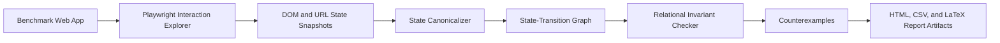

# RelUI: Relational Behavioral Consistency Testing for Web UIs

RelUI is a TypeScript + Playwright research prototype that tests Web UI behavior across interaction paths. Instead of checking one page or one click in isolation, RelUI explores workflows, infers a canonical state-transition graph, and checks relational invariants such as authentication preconditions, validation blocking, forbidden transitions, and path equivalence.

This repository is organized as a final-project artifact: it includes the tool, four controlled benchmark apps, sixteen injected faults, lightweight baselines, replayable counterexamples, an HTML report, CSV exports, coverage analytics, and LaTeX table snippets for the final paper.

## Why RelUI Exists

Traditional Web UI tests often answer questions like:

- Does this button exist?
- Did this page render?
- Does this screenshot look different?

RelUI answers workflow-level questions:

- Can a protected state be reached without authentication?
- Does invalid input ever advance a multi-step workflow?
- Do two alternative paths for the same task converge to equivalent states?
- Does logout, reset, cancel, or back navigation preserve the intended state contract?

These bugs are relational because the failure is not always visible in a single page snapshot. The bug appears when two paths, two states, or a precondition and a later state are compared.

## Approach Overview



The pipeline has five stages:

1. **Explore:** Playwright visits each app variant and executes deterministic seed traces plus bounded discovered actions.
2. **Canonicalize:** Raw DOM states are normalized into stable fingerprints using URL, visible text, controls, form values, and screenshots.
3. **Infer:** RelUI builds a graph whose nodes are canonical UI states and whose edges are user-triggered transitions.
4. **Check:** Relational invariants compare paths and states to detect workflow-level inconsistencies.
5. **Report:** Results are exported as a browsable report, CSV files, JSON data, and LaTeX table snippets.

## Quick Start

```bash
npm install
npx playwright install chromium
npm run run
```

Open the generated report:

```text
artifacts/report/index.html
```

## Commands

```bash
npm run relui -- run --config relui.config.ts
npm run relui -- explore --config relui.config.ts
npm run relui -- check --config relui.config.ts
npm run relui -- baseline --config relui.config.ts
npm run relui -- report --config relui.config.ts
```

Convenience scripts:

```bash
npm run run
npm run explore
npm run check
npm run baseline
npm run report
npm test
npm run typecheck
```

## Repository Layout

```text
benchmarks/server.ts        Controlled benchmark Web apps and injected variants
relui.config.ts             Subjects, seed traces, input profiles, and invariants
src/cli.ts                  relui command-line entrypoint
src/explorer.ts             Playwright exploration and trace replay
src/canonicalize.ts         State abstraction and canonical hashing
src/invariants.ts           Relational oracle implementation
src/baselines.ts            Structural and visual baseline checks
src/report/                 Metrics, HTML report, CSV export, LaTeX export
tests/                      Unit tests for core logic and report aggregation
artifacts/                  Generated graphs, screenshots, reports, tables, CSVs
```

## Benchmark Suite

RelUI evaluates four controlled Web applications. Each app has one clean variant and four faulty variants, for sixteen injected faults total.

| App | Clean Variant | Faulty Variants | Main Behaviors |
| --- | ---: | ---: | --- |
| Auth Portal | 1 | 4 | Login, logout, protected dashboard, role-gated admin page |
| Checkout Wizard | 1 | 4 | Cart validation, contact validation, payment, review, confirmation |
| Settings Workflow | 1 | 4 | Save, quick save, cancel, reset, notification settings |
| Transfer Workflow | 1 | 4 | Amount validation, recipient validation, review, confirmation, back/edit paths |

## Faults Injected

| Fault ID | App | Variant | Expected Relational Oracle |
| --- | --- | --- | --- |
| F-AUTH-1 | Auth | `auth-bypass` | Dashboard requires login |
| F-AUTH-2 | Auth | `logout-retains-access` | Logout clears protected access |
| F-AUTH-3 | Auth | `role-escalation` | Admin page requires admin login |
| F-AUTH-4 | Auth | `invalid-login-dashboard` | Invalid credentials block dashboard |
| F-CHECKOUT-1 | Checkout | `invalid-step-progression` | Invalid contact blocks payment |
| F-CHECKOUT-2 | Checkout | `skip-payment` | Express review cannot bypass payment |
| F-CHECKOUT-3 | Checkout | `negative-total` | Invalid cart quantity blocks contact |
| F-CHECKOUT-4 | Checkout | `back-loses-contact` | Alternative confirmation paths converge |
| F-SETTINGS-1 | Settings | `alt-save-stale` | Normal and quick profile saves converge |
| F-SETTINGS-2 | Settings | `cancel-persists-change` | Cancel does not persist edits |
| F-SETTINGS-3 | Settings | `reset-does-not-clear` | Reset clears saved edits |
| F-SETTINGS-4 | Settings | `stale-notification` | Notification save paths converge |
| F-TRANSFER-1 | Transfer | `invalid-amount-progression` | Invalid amounts block recipient collection |
| F-TRANSFER-2 | Transfer | `invalid-recipient-progression` | Invalid recipients block review |
| F-TRANSFER-3 | Transfer | `skip-confirmation` | Receipt requires explicit confirm action |
| F-TRANSFER-4 | Transfer | `back-loses-transfer` | Normal and back/edit receipts converge |

## Relational Invariant Types

RelUI currently implements five oracle families:

- `auth-precondition`: a target state must be preceded by one of the required actions.
- `validation-blocking`: an invalid input profile must not immediately reach a forbidden state.
- `action-forbidden-state`: after a specific action, a forbidden state must not appear.
- `forbidden-transition`: an inferred edge from one matched state to another matched state is illegal.
- `path-equivalence`: distinct workflow paths that represent the same task must converge to equivalent endpoint states.

These invariant definitions live in `relui.config.ts`, so the checker is reusable across apps.

## Assigned Metrics

The generated report directly covers the assigned evaluation tasks. The latest full run produced:

| Required Item | RelUI Output |
| --- | --- |
| Apps tested | 4 apps: Auth, Checkout, Settings, Transfer |
| Faults injected | 16 injected faults |
| States discovered | 230 canonical states |
| Transitions discovered | 467 graph transitions |
| Bugs detected | 16 / 16 injected fault variants detected |
| False positives | 0 relational violations on clean variants |
| Runtime | About 250 seconds end-to-end on the current machine |
| Example counterexamples | `artifacts/counterexamples.csv` and the HTML report counterexample cards |

The current run also explored 454 replayable traces and produced 59 relational violation instances in 250.08 seconds. Multiple violation instances can correspond to the same injected fault because several traces may expose the same bug.

## Generated Artifacts

After `npm run run`, RelUI writes:

```text
artifacts/report/index.html              Main browsable report
artifacts/assignment_metrics.csv         One-row-per-required-metric summary
artifacts/fault_coverage.csv             Fault-by-fault detection status
artifacts/coverage_by_app.csv            App-level coverage and cost metrics
artifacts/invariant_family_coverage.csv  Oracle-family detection contribution
artifacts/baseline_comparison.csv        RelUI vs structural/visual baselines
artifacts/runtime_by_subject.csv         Runtime and graph size per subject
artifacts/counterexamples.csv            Representative replayable counterexamples
artifacts/metrics.csv                    Backward-compatible subject metrics
artifacts/violations.csv                 All relational violation instances
artifacts/tables/*.tex                   LaTeX table snippets for the paper
artifacts/subjects/*/graph.json          Inferred state-transition graphs
artifacts/subjects/*/violations.json     Subject-level violation reports
artifacts/subjects/*/screenshots/*.png   Captured UI states
```

## Report-Ready Tables

RelUI generates LaTeX snippets under `artifacts/tables/`:

- `benchmark_subjects.tex`
- `injected_faults.tex`
- `detection_summary.tex`
- `coverage_by_app.tex`
- `invariant_family_coverage.tex`
- `baseline_comparison.tex`
- `runtime_scalability.tex`
- `counterexamples.tex`

These snippets use `booktabs` commands (`\toprule`, `\midrule`, `\bottomrule`), so include this in the paper preamble:

```latex
\usepackage{booktabs}
```

## Baselines

RelUI includes two lightweight baselines for comparison:

- **Structural baseline:** flags states whose visible control structure differs from the clean variant.
- **Visual baseline:** compares screenshots against matching clean traces using pixel difference.

The point of these baselines is not to beat mature testing frameworks. They provide a controlled comparison showing which injected faults are visible to structural or visual checks and which require relational reasoning.

## Example Counterexamples

Representative examples appear in the HTML report and `artifacts/counterexamples.csv`.

Examples of the kind of evidence produced:

- `F-AUTH-1`: opening the dashboard directly reaches a protected state without a login action.
- `F-CHECKOUT-2`: express review reaches order review without completing payment.
- `F-CHECKOUT-4`: normal checkout and back-navigation checkout reach different confirmation states.
- `F-SETTINGS-2`: cancel persists an edited profile name.
- `F-TRANSFER-4`: normal transfer and back/edit transfer reach receipts with different amount fields.

Each counterexample includes replay steps, trace IDs, start/end URLs, state text differences, and screenshots when available.

## How to Interpret the Report

Start with `artifacts/report/index.html`:

1. **Dashboard metrics:** answers the assigned metric list at a glance.
2. **Pipeline figure:** summarizes the technique for the report.
3. **App and fault matrix:** shows per-app coverage and detected fault IDs.
4. **RelUI vs baselines:** compares relational checking against structural and visual baselines.
5. **Fault coverage:** maps each injected fault to its detecting invariant and counterexample.
6. **Counterexamples:** provides replayable evidence for the most important bugs.
7. **State graph sketches:** summarizes the inferred model for each subject.

## Development Notes

Run unit tests:

```bash
npm test
```

Run TypeScript checking:

```bash
npm run typecheck
```

Regenerate only the report from existing graphs:

```bash
npm run check
npm run baseline
npm run report
```

Regenerate everything from scratch:

```bash
npm run run
```

## Troubleshooting

If Playwright cannot launch Chromium:

```bash
npx playwright install chromium
```

If the benchmark server port is busy, edit the port in `relui.config.ts` and the server command together.

If artifacts look stale, rerun:

```bash
npm run run
```

If you only changed reporting code and not exploration logic, this is faster:

```bash
npm run check && npm run baseline && npm run report
```

If tests leave temporary files, they are ignored through `.gitignore` under `artifacts-test/`.
